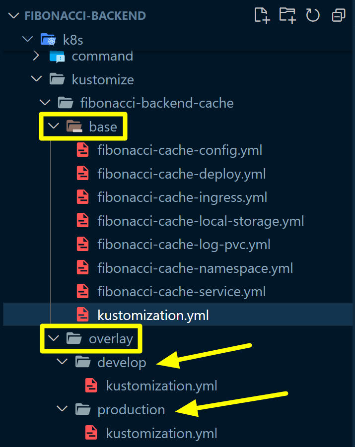

## Kustomize Overlay 작업
> 코드작업은 정말 빠르게 하고 쉬웠는데, 문서작업은 왜 이렇게 힘든걸까요? ㅠㅠ
<br/>

## 깃헙 리포지터리
여기서 정리하는 내용들은 [github.com/chagchagchag/fibonacci-backend](https://github.com/chagchagchag/fibonacci-backend) 내의 [fibonacci-backend/k8s/kustomize](https://github.com/chagchagchag/fibonacci-backend/tree/main/k8s/kustomize) 디렉터리에 있는 내용들입니다.<br/>

## Secret 
[fibonacci-backend/k8s/kustomize](https://github.com/chagchagchag/fibonacci-backend/tree/main/k8s/kustomize) 디렉터리 내의 `create-secret.sh` 파일에 대한 내용입니다.<br/>

kustomize 를 적용하기에 앞서서 아래의 내용을 적용해줍니다.
```bash
kubectl -n fibonacci create secret generic fibonacci-cache-secret --from-literal=api-key=abcd-efgh-ijkl-1111
```
<br/>

## Redis
[fibonacci-backend/k8s/kustomize](https://github.com/chagchagchag/fibonacci-backend/tree/main/k8s/kustomize) 디렉터리 내의 `create-redis.sh` 파일에 대한 내용입니다.<br/>
redis 가 설치되어 있지 않다면 아래의 내용을 적용해줍니다.
```bash
kubectl apply -f redis-service.yml
kubectl apply -f redis-pod.yml
```
<br/>

## fibonacci-backend-cache 의 kustomize 작업

대략적인 구조는 이렇습니다.<br/>

<br/>

`base` 디렉터리
- 기본적인 리소스 들의 정의 파일들을 둡니다.
- 이렇게 정의된 파일들을 `base` 디렉터리 내에서 kustomize 하는 역할을 하는 파일은 `kustomization.yml` 입니다.
<br/>

`overlay` 디렉터리
- `overlay/develop` 디렉터리
  - `base/kustomization.yml` 파일에서 조합한 리소스파일 들에서 `tag`, `namespace`를 `develop` 에 맞게끔 덮어쓰는 작업을 합니다.
  - `overlay/develop/kustomization.yml` 파일에서 따로 `develop` 버전에 맞도록 재정의한 `namespace`, `tag` 등이 적용되어 재정의됩니다.
- `overlay/production` 디렉터리
  - `base/kustomization.yml` 파일에서 조합한 리소스파일 들에서 `tag`, `namespace`를 `production` 에 맞게끔 덮어쓰는 작업을 합니다.
  - `overlay/production/kustomization.yml` 파일에서 따로 `production` 버전에 맞도록 재정의한 `namespace`, `tag` 등이 적용되어 재정의됩니다.<br/>

이렇게 작성한 파일들은 아래와 같이 적용합니다.
**develop Phase 에 배포할 경우**
```bash filename="bash" {0} copy
$ cd k8s/kustomize/fibonacci-backend-cache
$ cd overlay/develop
$ kubectl kustomize ./ | kubectl apply -f -
```
<br/>

**production Phase 에 배포할 경우**
```bash filename="bash" {0} copy
$ cd k8s/kustomize/fibonacci-backend-web
$ cd overlay/develop
$ kubectl kustomize ./ | kubectl apply -f -
```
<br/>

`kubectl kustomize ./` 명령은 현재 디렉터리 내의 `kustomization.yml` 파일에 정의한 리소스들을 기준으로 각각의 리소스를 조합해서 리소스 정의서를 만들어냅니다. 이렇게 해서 명령창에서 `kubectl kustomize ./` 을 실행하면 리소스 정의 yml 이 생성되니다.<br/>

`kubectl apply -f` 앞에 붙은 `-` 의 의미는 표준 입력을 의미합니다. `kubectl kustomize ./` 을 통해서 조합한 리소스 정의에 대한 yaml 문자열이 입출력 파이프라인 명령어인 `|` 을 통해 유입되고 이 파이프라인을 통해 kubectl kustomize ./ 명령어에 인자값으로 전달됩니다.<br/>

## 리소스 파일들
### base 
#### base/kustomization.yml
```yaml filename="base/kustomization.yml" {0} copy
apiVersion: kustomize.config.k8s.io/v1beta1
kind: Kustomization
resources:
- fibonacci-cache-namespace.yml
- fibonacci-cache-ingress.yml
- fibonacci-cache-config.yml
- fibonacci-cache-local-storage.yml
- fibonacci-cache-log-pvc.yml
- fibonacci-cache-deploy.yml
- fibonacci-cache-service.yml
```
<br/>

#### base/fibonacci-cache-config.yml
```yaml filename="base/fibonacci-cache-config.yml" {0} copy
apiVersion: v1
kind: ConfigMap
metadata:
  name: fibonacci-cache-config
  namespace: fibonacci
data:
  language: "ko"
```
<br/>

#### base/fibonacci-cache-ingress.yml
```yaml filename="base/fibonacci-cache-ingress.yml" {0} copy
apiVersion: networking.k8s.io/v1
kind: Ingress
metadata:
  name: fibonacci-ingress
  namespace: fibonacci
spec:
  rules:
    - http:
        paths:
          - pathType: Prefix
            path: /fibonacci
            backend:
              service:
                name: fibonacci-backend-cache-service
                port:
                  number: 8080
```
<br/>

#### base/fibonacci-cache-service.yml
```yaml filename="base/fibonacci-cache-service.yml" {0} copy
apiVersion: v1
kind: Service
metadata:
  name: fibonacci-backend-cache-service
  namespace: fibonacci
spec:
  selector:
    app: fibonacci-backend-cache
  ports:
    - protocol: TCP
      port: 8080
```
<br/>

#### base/fibonacci-cache-deploy.yml
```yaml filename="base/fibonacci-cache-deploy.yml" {0} copy
apiVersion: apps/v1
kind: Deployment
metadata:
  name: fibonacci-backend-cache-deploy
  namespace: fibonacci
spec:
  replicas: 2
  strategy:
    type: RollingUpdate
    rollingUpdate:
      maxSurge: 1
      maxUnavailable: 0
  selector:
    matchLabels:
      app: fibonacci-backend-cache
  template:
    metadata:
      labels:
        app: fibonacci-backend-cache
    spec:
      terminationGracePeriodSeconds: 60
      volumes:
        - name: cache-volume
          emptyDir:
            medium: Memory
        - name: log-volume
          persistentVolumeClaim:
            claimName: cache-log-storage-claim
      containers:
        - name: fibonacci
          image: chagchagchag/fibonacci-backend-cache:0.0.1
          imagePullPolicy: Always
          volumeMounts:
            - mountPath: /fibonacci/logs
              name: log-volume
            - mountPath: /fibonacci/cache
              name: cache-volume
          env:
            - name: APP_LANGUAGE
              valueFrom:
                configMapKeyRef:
                  name: fibonacci-cache-config
                  key: language
            - name: API_KEY
              valueFrom:
                secretKeyRef:
                  name: fibonacci-cache-secret
                  key: api-key
          lifecycle:
            preStop:
              exec:
                command: ["/bin/sh","-c","sleep 10"]
          readinessProbe:
            httpGet:
              path: /probe/healthcheck
              port: 8080
            initialDelaySeconds: 15
            periodSeconds: 1
            successThreshold: 2
            failureThreshold: 3
          livenessProbe:
            httpGet:
              path: /probe/healthcheck
              port: 8080
            initialDelaySeconds: 15
            periodSeconds: 1
            failureThreshold: 7
```
<br/>

#### base/fibonacci-cache-namespace.yml
```yaml filename="base/fibonacci-cache-namespace.yml" {0} copy
apiVersion: v1
kind: Namespace
metadata:
  name: fibonacci-cache
```
<br/>

#### base/fibonacci-cache-log-pvc.yml
```yaml filename="base/fibonacci-cache-log-pvc.yml" {0} copy
apiVersion: v1
kind: PersistentVolumeClaim
metadata:
  name: cache-log-storage-claim
  namespace: fibonacci
spec:
  # kubectl get sc 명령을 통해 나타나는 StorageClass 중 하나를 선택했다.
  # 로컬에서는 kind 클러스터 버전에 따라 standard 가 나올수도 있고 local-storage 가 나올수도 있다.
  storageClassName: standard
  accessModes:
    - ReadWriteOnce
  resources:
    requests:
      storage: 100Mi
```
<br/>

### overlay
overlay 에 정의하는 kustomization.yml 에는 주로 배포 Phase 에 맞는 환경, 이미지 명, 태그, 볼륨 명, 각종 환경 변수 등을 덮어쓰는 내용 들을 정의합니다.<br/>
<br/>

#### overlay/develop/kustomization.yml
```yaml filename="overlay/develop/kustomization.yml" {0} copy
apiVersion: kustomize.config.k8s.io/v1beta1
kind: Kustomization
resources:
  - ../../base
images:
  - name: chagchagchag/fibonacci-backend-cache
  - newName: chagchagchag/fibonacci-backend-cache
  - newTag: 0.0.1-fibonacci-backend-cache.01
namespace: fibonacci-cache-develop
```
<br/>

#### overlay/production/kustomization.yml
```yaml filename="overlay/production/kustomization.yml" {0} copy
apiVersion: kustomize.config.k8s.io/v1beta1
kind: Kustomization
resources:
  - ../../base
images:
  - name: chagchagchag/fibonacci-backend-cache
  - newName: chagchagchag/fibonacci-backend-cache
  - newTag: 0.0.1-fibonacci-backend-cache.01
namespace: fibonacci-cache-production
```
<br/>


