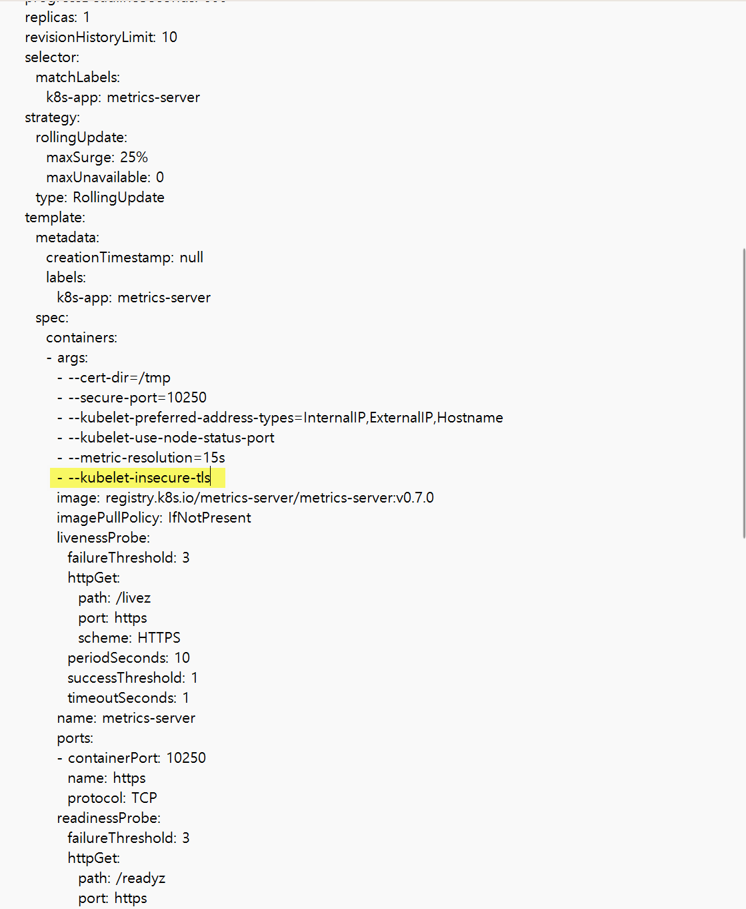

## HPA 정의 및 테스트

개인적으로 이런 매니페스트 파일 기반 리소스 테스트는 kustomize 를 이용하면 조금 더 편할 것 같습니다. 이번 실습에서는 kustomize 를 적용하면 다소 이해가 쉽지 않을 수 있어서 kustomize 를 예제에 적용하지는 않았습니다.<br/>


## 테스트 시나리오
HPA 가 잘 적용되는지 테스트를 해보는 테스트 시나리오는 아래와 같습니다. 꼭 HPA 의 동작을 확인한 후에는 다시 정상으로 돌려두어야 합니다.<br/>

로드 유발 쉘스크립트 작성
- 테스트를 위해 `generate-load-request.sh` 에서는 1초에 50개의 request 를 보내는데 [http://localhost:8080/number=1](http://localhost:8080/number=1) 을 단순 GET 요청으로 보냅니다. 
  <br/>


쿠버네티스 애플리케이션에 지연코드 추가

- 테스트를 위해 지연이 발생하는 코드를 쿠버네티스 애플리케이션에 추가합니다.
- `fibonacci-backend-web` 내에서 fibonacci 계산을 수행하는 함수에 500ms 의 delay 를 부여합니다. 이렇게 해서 1초에 약 2번 정도 연산을 수행할 수 있는 상황을 가정합니다.

<br/>


spring boot 애플리케이션에 지연 코드 추가

- 테스트를 위해 애플리케이션의 `localhost:8080/number=1` 이 1초에 2번의 요청만 수행가능한 환경을 가정합니다.

<br/>


spring boot 애플리케이션의 톰캣 스레드 풀 사이즈 수정

- 스레드 풀을 10개만 있는 상황을 가정합니다.
- 이렇게 하면 하나의 파드는 1초에 2번의 요청을 처리할 수 있는 API를 10개의 스레드에서 운영하게 되므로 1초에 10개의 스레드를 이용해 20번의 요청을 처리할 수 있습니다. 이런 상황을 가정해서 테스트를 수행하겠습니다.

<br/>


테스트를 위한 파드의 성능 축소, Probe 재시동 판단 조건 완화
- CPU, Memory 를 조금은 작은 용량으로 준비해둡니다. 스케일링이 잘 되는지 확인해보기 위해서입니다.
- 오토스케일링 테스트를 위해 readinessProbe, livenessProbe 를 통해 파드의 재시동 주기를 조절합니다. 가급적 재시동이 자주 걸리지 않도록 변경해줍니다.
- readiness 프로브에서는 successThreshold를 작게주어서 재기동 중에 다시 재기동이 이뤄지지 않도록 하고, failureThreshold 는 더 크게 주어서 관대하게 설정을 합니다. 
- liveness 프로브에는 failureThreshold 를 조정해서 live 판정이 조금 더 자주 일어나지 않도록 조정합니다.

<br/>


HPA 적용 및 테스트
- 재기동이 민감하지 않은 것을 확인했으면 이제는 HPA 설정을 시작합니다. minReplicas=2, maxReplicas=5 로 주어서 2~5 사이에서 스케일링이 이뤄지게끔 합니다. averageUtilization 은 50 으로 주어서 1000m * 50% 인 500m 일때 스케일링이 일어나도록 설정해줍니다. 그리고 stabilizationWindowSeconds 를 지정해서 스케일링 주기를 결정합니다.
- 스케일링이 이뤄지는지 `generate-load-request.sh` 를 통해 확인해봅니다.
<br/>

## 사전 준비
### 클러스터 생성
kind 클러스터가 로컬 개발환경에 설치되어 있지 않은 상태인 경우 아래와 같이 kind 클러스터를 설치해줍니다.
```bash
cd cluster
source create-cluster.sh
```
<br/>

### redis 설치
```bash
cd k8s/plain-deploy/fibonacci-common
kubectl apply -f redis.yml
```
<br/>

redis.yml 의 yaml 파일 내용은 아래와 같고 [github.com/chaghchagchag/fibonacci-bacend/redis.yml](https://github.com/chagchagchag/fibonacci-backend/blob/main/k8s/plain-deploy/fibonacci-common/redis.yml) 에서 확인 가능합니다.
```yaml
apiVersion: v1
kind: Service
metadata:
  name: redis-service
spec:
  selector:
    app: redis
  ports:
    - protocol: TCP
      port: 6379
      targetPort: 6379
---
apiVersion: v1
kind: Pod
metadata:
  name: redis
  labels:
    app: redis
spec:
  containers:
    - name: redis
      image: redis
      ports:
        - containerPort: 6379
```
<br/>


## 로드 유발 쉘스크립트 작성
### metrics-server 설치
[`metrics-server`](https://github.com/kubernetes-sigs/metrics-server) 는 k8s 플랫폼마다 기본으로 설치된 곳도 있고 아닌 플랫폼도 있습니다. 로컬 클러스터인 [`kind` 클러스터](https://kind.sigs.k8s.io/)에서도 설치가 되어있는지 확인이 필요합니다.<br/>

클러스터 내에 `metrics-server`가 설치되었는지 확인을 합니다.
```bash filename="bash" {0} copy
$ kubectl top nodes
error: Metrics API not available
```
<br/>


`metrics-server` 가 설치되어 있지 않습니다. [`metrics-server`](https://github.com/kubernetes-sigs/metrics-server) 에 방문해서 `metrics-server`를 설치합니다.<br/>

[metrics-server#installation](https://github.com/kubernetes-sigs/metrics-server?tab=readme-ov-file#installation)에서는 metrics-server 를 설치하는 명령어를 알려주고 있습니다. 이 명령어를 복사해서 쿠버네티스 클러스터에 적용해줍니다.<br/>

```bash filename="bash" {0} copy
kubectl apply -f https://github.com/kubernetes-sigs/metrics-server/releases/latest/download/components.yaml
```
<br/>


이렇게 설치를 해도 아래와 같이 `kubectl top nodes` 로 현황을 확인해도 에러 메시지가 나타나는 경우가 있습니다.
```bash filename="bash" {0} copy
$ kubectl top nodes
error: Metrics API not available
```
<br/>


이 경우 아래와 같이 metrics-server 라는 이름의 deployment 를 수정하는 명령어를 실행해줍니다.

```bash filename="bash" {0} copy
kubectl edit deployments -n kube-system metrics-server
```
<br/>


그리고 나타나는 시스템 에디터에서는 `--kubelet-insecure-tls` 옵션을 추가해준 후 저장합니다.

<br/>


설치가 잘 되었는지 확인해봅니다. 결과를 보니 잘 설치되었습니다. (제일 아래줄에 `metrics-server-796fbd6c9d-29hdz` 을 확인 가능)
```bash filename="bash" {0} copy
$ kubectl -n kube-system get pods
NAME                                                      READY   STATUS    RESTARTS   AGE
coredns-5d78c9869d-hx9td                                  1/1     Running   0          48m
coredns-5d78c9869d-stjkw                                  1/1     Running   0          48m
etcd-fibonacci-cluster-control-plane                      1/1     Running   0          48m
kindnet-rzptz                                             1/1     Running   0          48m
kindnet-vhxbz                                             1/1     Running   0          48m
kube-apiserver-fibonacci-cluster-control-plane            1/1     Running   0          48m
kube-controller-manager-fibonacci-cluster-control-plane   1/1     Running   0          48m
kube-proxy-m46jh                                          1/1     Running   0          48m
kube-proxy-mtrtz                                          1/1     Running   0          48m
kube-scheduler-fibonacci-cluster-control-plane            1/1     Running   0          48m
metrics-server-796fbd6c9d-29hdz                           1/1     Running   0          23s
```
<br/>

`kubectl top nodes` 명령을 통해 지표들이 수집되는지 확인해봅니다.
```bash filename="bash" {0} copy
$ kubectl top nodes
NAME                              CPU(cores)   CPU%   MEMORY(bytes)   MEMORY%
fibonacci-cluster-control-plane   144m         0%     1213Mi          6%
fibonacci-cluster-worker          29m          0%     283Mi           1%
```
<br/>


### curl 요청 쉘스크립트 추가

단순한 코드입니다. 1초에 한번씩 50개의 curl 요청을 `GET http://localhost:8080/number=1` 으로 보내는 쉘스크립트입니다.

```bash filename="load.sh" {0} copy 
#!/bin/bash

while true; do    
  count=50

  for ((i = 0; i < count; i++)); do
    curl "http://localhost:8080/fibonacci?number=1" &
  done
 
  sleep 1  
done

```

<br/>


## spring boot  애플리케이션에 지연코드 추가

> 이번 테스트 실습이 끝난 후에는 반드시 지연코드를 지우고 원래의 코드로 되돌려놓아야 합니다.<br/>

`localhost:8080/fibonacci` API 수행시 500ms 만큼 지연이 계속해서 발생하는 상황을 가정한 delay 코드를 추가합니다.<br/>

추가한 코드 옆 또는 코드 위에 주석을 추가해두었습니다.

```java
@Service
public class FibonacciService {
    
    // ... 
    
    public BigDecimal getFibonacci(int number) {
        delayMs(500); // 여기에 추가
        if(number == 0) return BigDecimal.ZERO;
        else if(number == 1) return BigDecimal.ONE;
        else if(number == 2) return BigDecimal.ONE;
        else{
            if(dp.containsKey(number)) return dp.get(number);

            dp.put(number, getFibonacci(number-2).add(getFibonacci(number-1)));

            return dp.get(number);
        }
    }

    // 여기이 코드를 보시면 됩니다. 
    public void delayMs(long ms){
        long spentTime = 0L;
        long started = System.currentTimeMillis();
        do {
            spentTime = System.currentTimeMillis() - started;
        } while(spentTime < ms);
    }
    
    // ...
    
}
```

<br/>


## spring boot 애플리케이션의 톰캣 스레드 풀 사이즈 수정

> 이번 테스트 실습이 끝난 후에는 반드시 원래의 톰캣 스레드 풀 설정으로 되돌려줘야 합니다.<br/>

스프링 컨테이너의 커넥션을 처리하는 스레드가 부족해지는 상황을 가정하기 위해 스프링 부트 톰캣 스레드 풀의 사이즈를 10으로 수정합니다. 스프링 부트 톰캣 스레드 풀의 기본사이즈는 200 입니다.<br/>

`fibonacci-backend-web/src/resources/application.yml`

- `server.tomcat.threads.max` 를 10 으로 설정해주었습니다.

```yaml filename="fibonacci-backend-web/src/resources/application.yml" {0} copy
server:
  shutdown: graceful
  tomcat:			## 여기에 추가해주었습니다.
    threads:		## 여기에 추가해주었습니다.
      max: 10		## 여기에 추가해주었습니다.

spring:
  lifecycle:
    timeout-per-shutdown-phase: 50s
  data:
    redis:
      host: redis-server.default.svc.cluster.local
      port: 6379

#logging:
#  file:
#    name: /var/log/app/fibonacci.log
```

<br/>


## 테스트를 위한 파드의 성능 축소, Probe 재시동 판단 조건 완화

### CPU, Memory 의 requests, limits 수정

> 이번 테스트 실습이 끝난 후에는 반드시 원래의 CPU, Memory 설정으로 되돌려줘야 합니다.<br/>

테스트를 위해 파드의 스펙을 축소해서 아래와 같이 수정해줍니다.
- memory 
  - requests : "512Mi"
  - limits : "1Gi"
- cpu 
  - requests: "1000m"
  - limits: "1500m"
  <br/>

수정해준 부분은 아래에 `## *** 여기를 수정함` 이라는 주석으로 명시해두었습니다.<br/>


**hpa 코드 (k8s/plain-deploy/fibonacci-backend-web-deploy.yml)**

```yaml filename="fibonacci-backend-deploy.yaml" {0} copy
apiVersion: apps/v1
kind: Deployment
metadata:
  name: fibonacci-backend-web-deploy
  namespace: fibonacci
spec:
  replicas: 2
  strategy:
    type: RollingUpdate
    rollingUpdate:
      maxSurge: 1
      maxUnavailable: 0
  selector:
    matchLabels:
      app: fibonacci-backend-web
  template:
    metadata:
      labels:
        app: fibonacci-backend-web
    spec:
      terminationGracePeriodSeconds: 60
      containers:
        - name: fibonacci
          image: chagchagchag/fibonacci-backend-web:0.0.1
          imagePullPolicy: Always
          ## 여기서부터 시작
          resources:
            requests:
              memory: "512Mi" ## *** 여기를 수정함
              cpu: "1000m"    ## *** 여기를 수정함
            limits:
              memory: "1Gi"   ## *** 여기를 수정함
              cpu: "1500m"    ## *** 여기를 수정함

## ...

```
<br/>


### Probe 재시동 판단 조건 완화

> 테스트가 끝난 후에는 반드시 원래의 Probe 설정으로 되돌려줘야 합니다.<br/>

성능을 축소했기에 파드가 재시동될 가능성이 높습니다. 재시동으로 인한 CPU 점유율이 올라갈 때 축소한 성능을 넘어서는 경우가 있어서 재기동이 계속해서 생길 수 있는데 이 부분에 대해서 Probe 로 재시동 요건을 완화해줍니다. 이렇게 성능을 축소한 후에 재기동 횟수를 최소화 하는 이유는 HPA 가 정상적으로 수행되는지를 확인하기 위해서입니다. <br/>


#### Readiness Probe 설정 완화

> 테스트가 끝난 후에는 반드시 원래의 Probe 설정으로 되돌려줘야 합니다.<br/>

전체 코드는 [github.com/chagchagchag/fibonacci-backend/k8s/plain-deploy/fibonacci-backend-web/fibonacci-web-deploy.yml](https://github.com/chagchagchag/fibonacci-backend/blob/main/k8s/plain-deploy/fibonacci-backend-web/fibonacci-web-deploy.yml) 을 참고하시면 됩니다.

- successThreshold = 2, failureThreshold = 3 으로 되어 있던 것을 successThreshold = 1, failureThreshold = 2 로 변경해줬습니다.
- 원래 설정은 두번 성공해야 네트워크를 허용하고, 세번 실패해야 네트워크를 끊는 설정이었는데 이것을 변경해서 한번만 성공해도 네트워크에 접속이 가능하게 하고 두번 실패했을 때에 네트워크를 끊도록 하는 설정으로 변경해주었습니다.

```yaml
apiVersion: apps/v1
kind: Deployment
metadata:
  name: fibonacci-backend-web-deploy
  namespace: fibonacci
spec:
  replicas: 2
  strategy:
    type: RollingUpdate
    rollingUpdate:
      maxSurge: 1
      maxUnavailable: 0
  selector:
    matchLabels:
      app: fibonacci-backend-web
  template:
    metadata:
      labels:
        app: fibonacci-backend-web
    spec:
      terminationGracePeriodSeconds: 60
      containers:
        - name: fibonacci
          image: chagchagchag/fibonacci-backend-web:0.0.1
          
          ## ...
          
          readinessProbe:
            httpGet:
              path: /probe/ready
              port: 8080
            initialDelaySeconds: 45
            periodSeconds: 1
            successThreshold: 1
            failureThreshold: 2
          
          ## ...
```

<br/>


#### Liveness Probe 설정 완화

> 테스트가 끝난 후에는 반드시 원래의 Probe 설정으로 되돌려줘야 합니다.<br/>


전체 코드는 [github.com/chagchagchag/fibonacci-backend/k8s/plain-deploy/fibonacci-backend-web/fibonacci-web-deploy.yml](https://github.com/chagchagchag/fibonacci-backend/blob/main/k8s/plain-deploy/fibonacci-backend-web/fibonacci-web-deploy.yml) 을 참고하시면 됩니다.

- failureThreshold 가 3이었던 것을 10으로 변경했습니다.
- livenessProbe의 경우 컨테이너 자체를 restart 하는 것으로 인해 장기간 파드가 작업을 처리하지 못하도록 하는 문제가 있기 때문에 원래 3 이었던 `failureThreshold` 를 10 으로 늘려서 되도록이면 restart 필요 없이 readinessProbe 만으로 트래픽 양을 제어하면서 트래픽을 처리할 수 있도록 변경해줬다.

```yaml
apiVersion: apps/v1
kind: Deployment
metadata:
  name: fibonacci-backend-web-deploy
  namespace: fibonacci
spec:
  replicas: 2
  strategy:
    type: RollingUpdate
    rollingUpdate:
      maxSurge: 1
      maxUnavailable: 0
  selector:
    matchLabels:
      app: fibonacci-backend-web
  template:
    metadata:
      labels:
        app: fibonacci-backend-web
    spec:
      terminationGracePeriodSeconds: 60
      containers:
        - name: fibonacci
          image: chagchagchag/fibonacci-backend-web:0.0.1
          
          ## ...
          
          livenessProbe:
            httpGet:
              path: /probe/live
              port: 8080
            initialDelaySeconds: 45
            periodSeconds: 1
            failureThreshold: 10 ### 이곳을 수정 
```

<br/>


#### 낮춘 서버 사양에 맞도록 각 프로브의 `initialDelaySeconds` 수정
- 서버사양을 낮춘 만큼 부팅이 늦어질 가능성이 높기 때문에 Redyness 프로브, Startup 프로브의 `initialDelaySeconds` 를 아래와 같이 45 로 수정해줍니다.
<br/>

```yaml
## ...
          startupProbe:
            httpGet:
              path: /probe/startup
              port: 8080
            initialDelaySeconds: 45
            periodSeconds: 1
            failureThreshold: 10
          readinessProbe:
            httpGet:
              path: /probe/ready
              port: 8080
            initialDelaySeconds: 45
            periodSeconds: 1
            successThreshold: 1
            failureThreshold: 2
          livenessProbe:
            httpGet:
              path: /probe/live
              port: 8080
            initialDelaySeconds: 45
            periodSeconds: 1
            failureThreshold: 10
```

<br/>


## HPA 적용 및 테스트

### kubectl -n fibonacci get pods 를 1초 단위로 모니터링

터미널에 아래의 명령어를 수행해서 1초에 한번씩 pod 의 상태를 모니터링합니다.

```bash
watch -n 1 kubectl -n fibonacci get pods
```

이렇게 하면 watch -n 1 명령은 1초에 한번씩(-n 1) watch 를 하겠다는 의미이고, kubectl get pod 를 1초에 한번씩 수행해서 터미널에 출력하게 됩니다.

<br/>


### kubectl -n fibonacci get top pods 를 1초 단위로 모니터링

터미널에 아래의 명령어를 수행해서 1초에 한번씩 pod의 CPU, MEMORY 현황을 모니터링합니다.

```bash
watch -n 1 kubectl -n fibonacci top pods
```

이렇게 하면 watch -n 1 명령은 1초에 한번씩(-n 1) watch 를 하겠다는 의미이고, kubectl top pods 를 1초에 한번씩 수행해서 터미널에 출력하게 됩니다.

<br/>


### `generate-load-request.sh` 실행

이 문서의 초입에서 작성했던 `generate-load-request.sh`을 실행합니다.

```bash
source generate-load-request.sh
```


### HPA 적용 전후 테스트

#### HPA 적용 전

- 스크린샷 추가 예정 (순간포착이 쉽지 않아서 따로 캡처작업을 수행 예정)

<br/>


#### HPA 적용 

pod 를 2 \~ 5 개로 성능 지표에 따라서 스케일업이 발생하도록 리소스를 정의한 코드는 아래와 같습니다.

```yaml
apiVersion: autoscaling/v2
kind: HorizontalPodAutoscaler
metadata:
  name: fibonacci-backend-hpa
  namespace: fibonacci
spec:
  minReplicas: 2
  maxReplicas: 5
  scaleTargetRef:
    apiVersion: apps/v1
    kind: Deployment
    name: fibonacci-backend-web
  metrics:
    - type: Resource
      resource:
        name: cpu
        target:
          type: Utilization
          averageUtilization: 50
  behavior:
    scaleUp:
      stabilizationWindowSeconds: 30
    scaleDown:
      stabilizationWindowSeconds: 30
```

<br/>


spec.minReplicas, spec.maxReplicas

- min : 2, max: 5 로 해서 최소 2기의 파드로 운영되고 부하가 심할 때는 최대 5기의 파드로 운영되게끔 지정해줬습니다.

```yaml
spec:
  minReplicas: 2
  maxReplicas: 5
  # ...
```

<br/>


spec.metrics ... 

- Resource 타입의 메트릭을 지정해줬고, cpu 자원에 대해 `Utilization` 을 적용해주었고 averageUtilization 을 50 으로 지정해줬습니다.
- averageUtilization 에 대해서는 [쿠버네티스의 스케일링](https://chagchagchag.github.io/docs-fibonacci-backend/kubernetes-overview/kubernetes-scaling/) 문서에 설명을 정리해두었습니다.

```yaml
spec:
  # ... 
  metrics:
    - type: Resource
      resource:
        name: cpu
        target:
          type: Utilization
          averageUtilization: 50
```

<br/>


#### HPA 적용 후

- 스크린샷 추가 예정 (순간포착이 쉽지 않아서 따로 캡처작업을 수행 예정)


