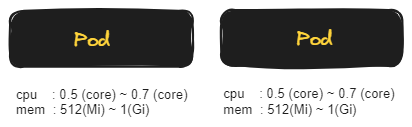
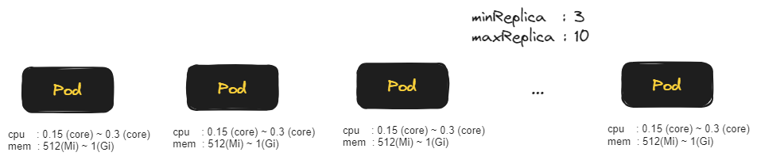

## HPA 정의 및 테스트

kustomize 를 적용해서 hpa 적용버전, 일반 deployment 를 적용할수도 있겠지만, 이렇게 하면 kustomize 까지 설명해야 해서 이번 문서인 HPA테스트 문서는 일반적인 yaml 파일로 HPA를 정의하고 테스트했습니다.<br/>


## 테스트의 가정 범위

API 하나가 500m 이 소모되는 다소 무거운 블로킹이 발생하는 요건 내에서 1초에 400건의 curl 요청을 수행할 때 Pod가 재기동되지 않도록 스케일아웃이 이뤄지는지를 테스트해봅니다.<br/>


### HPA 를 적용하지 않은 일반 디플로이먼트



파드 하나는 1초에 2번의 요청을 처리할 수 있는 API를 10개의 커넥션 스레드 풀에서 운영합니다. 따라서 파드 하나는 1초에 20개의 요청을 처리할 수 있다고 추측하고 있습니다. 그리고 파드는 2개를 운영합니다. 따라서 1초에 40개의 요청까지는 정상적으로 처리가 가능하다는 것을 가정합니다.<br/>

로드 유발 스크립트는 0.5초마다 200개의 요청을 합니다. 즉, 클라이언트 측에서는 API에 1초에 400개의 API 요청을 수행하는 것을 가정합니다.<br/>

테스트 수행결과는 아래의 링크를 참고해주세요. 파드 2기가 결국은 RESTART를 하게 됩니다.

- [HPA 를 적용하지 않은 단순 디플로이먼트의 동작](https://youtu.be/1EZ1YGYcqi4?si=om9Dk3aecIouUv4w)

<br/>


### HPA 적용 후 디플로이먼트 테스트



파드 하나는 1초에 2번의 요청을 처리할 수 있는 API를 10개의 커넥션 스레드 풀에서 운영합니다. 따라서 파드 하나는 1초에 20개의 요청을 처리할 수 있다고 추측하고 있습니다. 그리고 파드는 최소 3개에서 10개가 스케일링 되도록 HPA(HorizontalPodAutoscaler) 기반으로 운영합니다. 따라서 1초에 최소 60개의 요청이 처리 가능하고 최대 200개의 요청까지는 정상적으로 처리가 가능하다는 추론이 가능합니다. (`60 ~ 200`)<br/>

로드 유발 스크립트는 0.5초마다 200개의 요청을 합니다. 즉, 클라이언트 측에서는 API에 1초에 400개의 API 요청을 수행하는 것을 가정합니다.<br/>

테스트 수행결과는 아래의 링크를 참고해주세요. 실험 결과는 파드 10기까지 HPA 를 통해 스케일아웃이 발생하며, CPU 점유율이 모든 파드가 300m 까지 치솟았다가 평균적으로 모든 파드가 `100m` 수준을 유지하게 되는 것을 확인 가능합니다.

- [HPA 가 적용된 디플로이먼트](https://youtu.be/vK_nj7bbdZw?si=mY3U9Tei_1pR5gKD)

<br/>

API 하나가 500m 이 소모되는 다소 무거운 블로킹이 발생하는 테스트 요건임에도 불구하고  각각의 CPU 점유율이 100m 정도의 점유율을 유지하며 10개의 파드가 운영되기에 1코어 ~ 1.5코어 정도의 CPU 점유율을 가진다고 추론이 가능합니다. <br/>

HPA를 적용하지 않은 일반 디플로이먼트를 테스트할 때는 최대 1.5 코어를 가지는 파드 2기로 운영해도 계속해서 리부팅이 되었는데, 10기의 파드를 0.1코어의 점유율로 운영할 때 리부팅 없이 정상 운영되는 것을 확인 가능합니다.<br/>

<br/>


## 예제 적용범위, 예제 스크립트 경로

**예제 적용범위**<br/>

이번 예제는 `fibonacci-backend-web` 에 범위를 한정했습니다.<br/>

`fibonacci-backend-cache` 까지 적용해서 테스트하기에는 문서의 범위가 너무 길어져서 `fibonacci-backend-web` 까지로 범위를 한정했습니다.<br/>


**예제 스크립트 경로**<br/>

이번 예제에서 사용한 성능 테스트를 위한 리소스 정의 파일 및 쉘 스크립트들은 아래 링크에서 모두 찾아볼 수 있습니다.

- [github.com/fibonacci-backend/k8s/plain-deploy/fibonacci-backend-web/test](https://github.com/chagchagchag/fibonacci-backend/tree/main/k8s/plain-deploy/fibonacci-backend-web/test)

<br/>


## 테스트 영상

테스트해본 영상은 길이가 다소 길고 Github 에 업로드할 수 없어서 Youtube에 업로드해두었고 아래의 링크를 통해서만 시청이 가능합니다.

- [HPA 를 적용하지 않은 단순 디플로이먼트의 동작](https://youtu.be/1EZ1YGYcqi4?si=om9Dk3aecIouUv4w)
- [HPA 가 적용된 디플로이먼트](https://youtu.be/vK_nj7bbdZw?si=mY3U9Tei_1pR5gKD)

<br/>


이번 문서에서는 위 영상들의 시연 영상을 캡처한 이미지들을 기반으로 HPA 적용시에 어떻게 달라지고, HPA 적용전에는 어떤지를 설명합니다.<br/>


## 테스트 시나리오
HPA 가 잘 적용되는지 테스트를 해보는 테스트 시나리오는 아래와 같습니다. 꼭 HPA 의 동작을 확인한 후에는 다시 정상으로 돌려두어야 합니다.<br/>


로드 유발 쉘스크립트 작성
- 테스트를 위해 `generate-load-request.sh` 에서는 0.5초마다 200개의 request 를 보내는데 [http://localhost/fibonacci?number=11](http://localhost/fibonacci?number=11) 을 단순 GET 요청으로 보냅니다. 

<br/>


Spring Boot 애플리케이션에 지연코드 추가

- 테스트를 위해 지연이 발생하는 코드를 쿠버네티스 애플리케이션에 추가합니다.
- `fibonacci-backend-web` 내에서 fibonacci 계산을 수행하는 함수에 500ms 의 delay 를 부여합니다. 
- 애플리케이션에서는 API 에 대해 수행하는 연산이 500ms 의 시간이 걸린다는 것을 가정합니다. 500ms 는 애플리케이션 입장에서는 꽤 큰 지연시간입니다.

<br/>


Spring Boot 애플리케이션의 톰캣 스레드 풀 사이즈 수정

- 스레드 풀을 10개만 있는 상황을 가정합니다.
- 이렇게 하면 하나의 파드는 1초에 2번의 요청을 처리할 수 있는 API를 10개의 커넥션 스레드 풀에서 운영하게 되므로 1초에 10개의 스레드를 이용해 20번의 요청을 처리할 수 있습니다. 이런 상황을 가정해서 테스트를 수행하겠습니다.

<br/>


HPA 적용 전 일반 디플로이먼트 테스트

- 일반 디플로이먼트를 테스트하기 위한 리소스 정의 파일을 작성합니다.
- [github.com/fibonacci-backend/k8s/plain-deploy/fibonacci-backend-web/test](https://github.com/chagchagchag/fibonacci-backend/tree/main/k8s/plain-deploy/fibonacci-backend-web/test) 내의 [fibonacci-web-hpa-not-applied.yml](https://github.com/chagchagchag/fibonacci-backend/blob/main/k8s/plain-deploy/fibonacci-backend-web/test/fibonacci-web-hpa-not-applied.yml) 파일을 kubectl apply -f 로 적용해줍니다.

<br/>


HPA 적용 후 디플로이먼트 테스트

- HPA 가 적용된 버전의 리소스 정의 파일을 작성합니다.
- [github.com/fibonacci-backend/k8s/plain-deploy/fibonacci-backend-web/test](https://github.com/chagchagchag/fibonacci-backend/tree/main/k8s/plain-deploy/fibonacci-backend-web/test) 내의 [fibonacci-web-hpa-applied.yml](https://github.com/chagchagchag/fibonacci-backend/blob/main/k8s/plain-deploy/fibonacci-backend-web/test/fibonacci-web-hpa-applied.yml) 파일을 kubectl apply -f 로 적용해줍니다.

<br/>


## 사전 준비
### 클러스터 생성
kind 클러스터가 로컬 개발환경에 설치되어 있지 않은 상태인 경우 아래와 같이 kind 클러스터를 설치해줍니다.
```bash
cd cluster
source create-cluster.sh
```
<br/>

### redis 설치
```bash
cd k8s/plain-deploy/fibonacci-common
kubectl apply -f redis.yml
```
<br/>

redis.yml 의 yaml 파일 내용은 아래와 같고 [github.com/chaghchagchag/fibonacci-bacend/redis.yml](https://github.com/chagchagchag/fibonacci-backend/blob/main/k8s/plain-deploy/fibonacci-common/redis.yml) 에서 확인 가능합니다.
```yaml
apiVersion: v1
kind: Service
metadata:
  name: redis-service
spec:
  selector:
    app: redis
  ports:
    - protocol: TCP
      port: 6379
      targetPort: 6379
---
apiVersion: v1
kind: Pod
metadata:
  name: redis
  labels:
    app: redis
spec:
  containers:
    - name: redis
      image: redis
      ports:
        - containerPort: 6379
```
<br/>


### metrics-server 설치

[`metrics-server`](https://github.com/kubernetes-sigs/metrics-server) 는 k8s 플랫폼마다 기본으로 설치된 곳도 있고 아닌 플랫폼도 있습니다. 로컬 클러스터인 [`kind` 클러스터](https://kind.sigs.k8s.io/)에서도 설치가 되어있는지 확인이 필요합니다.<br/>

클러스터 내에 `metrics-server`가 설치되었는지 확인을 합니다.

```bash filename="bash" {0} copy
$ kubectl top nodes
error: Metrics API not available
```

<br/>


`metrics-server` 가 설치되어 있지 않습니다. [`metrics-server`](https://github.com/kubernetes-sigs/metrics-server) 에 방문해서 `metrics-server`를 설치합니다.<br/>

[metrics-server#installation](https://github.com/kubernetes-sigs/metrics-server?tab=readme-ov-file#installation)에서는 metrics-server 를 설치하는 명령어를 알려주고 있습니다. 이 명령어를 복사해서 쿠버네티스 클러스터에 적용해줍니다.<br/>

```bash filename="bash" {0} copy
kubectl apply -f https://github.com/kubernetes-sigs/metrics-server/releases/latest/download/components.yaml
```

<br/>


이렇게 설치를 해도 아래와 같이 `kubectl top nodes` 로 현황을 확인해도 에러 메시지가 나타나는 경우가 있습니다.

```bash filename="bash" {0} copy
$ kubectl top nodes
error: Metrics API not available
```

<br/>


이 경우 아래와 같이 metrics-server 라는 이름의 deployment 를 수정하는 명령어를 실행해줍니다.

```bash filename="bash" {0} copy
kubectl edit deployments -n kube-system metrics-server
```

<br/>


그리고 나타나는 시스템 에디터에서는 `--kubelet-insecure-tls` 옵션을 추가해준 후 저장합니다.

<br/>


설치가 잘 되었는지 확인해봅니다. 결과를 보니 잘 설치되었습니다. (제일 아래줄에 `metrics-server-796fbd6c9d-29hdz` 을 확인 가능)

```bash filename="bash" {0} copy
$ kubectl -n kube-system get pods
NAME                                                      READY   STATUS    RESTARTS   AGE
coredns-5d78c9869d-hx9td                                  1/1     Running   0          48m
coredns-5d78c9869d-stjkw                                  1/1     Running   0          48m
etcd-fibonacci-cluster-control-plane                      1/1     Running   0          48m
kindnet-rzptz                                             1/1     Running   0          48m
kindnet-vhxbz                                             1/1     Running   0          48m
kube-apiserver-fibonacci-cluster-control-plane            1/1     Running   0          48m
kube-controller-manager-fibonacci-cluster-control-plane   1/1     Running   0          48m
kube-proxy-m46jh                                          1/1     Running   0          48m
kube-proxy-mtrtz                                          1/1     Running   0          48m
kube-scheduler-fibonacci-cluster-control-plane            1/1     Running   0          48m
metrics-server-796fbd6c9d-29hdz                           1/1     Running   0          23s
```

<br/>

`kubectl top nodes` 명령을 통해 지표들이 수집되는지 확인해봅니다.

```bash filename="bash" {0} copy
$ kubectl top nodes
NAME                              CPU(cores)   CPU%   MEMORY(bytes)   MEMORY%
fibonacci-cluster-control-plane   144m         0%     1213Mi          6%
fibonacci-cluster-worker          29m          0%     283Mi           1%
```

<br/>


## 로드 유발 쉘스크립트 작성
단순한 코드입니다. 0.5초에 한번씩 200개의 curl 요청을 `GET http://localhost/fibonacci?number=11` 으로 보내는 쉘스크립트입니다.

```bash filename="load.sh" {0} copy 
#!/bin/bash

while true; do
  count=200

  for ((i = 0; i < count; i++)); do
    curl "http://localhost/fibonacci?number=11" &
  done

  sleep 0.5
done
```

<br/>


## Spring Boot 애플리케이션에 지연코드 추가

> 이번 테스트 실습이 끝난 후에는 반드시 지연코드를 지우고 원래의 코드로 되돌려놓아야 합니다.<br/>

`localhost:8080/fibonacci` API 수행시 500ms 만큼 지연이 계속해서 발생하는 상황을 가정한 delay 코드를 추가합니다.<br/>

추가한 코드 옆 또는 코드 위에 주석을 추가해두었습니다.

```java
@Service
public class FibonacciService {
    
    // ... 
    
    public BigDecimal getFibonacci(int number) {
        delayMs(500); // 여기에 추가
        if(number == 0) return BigDecimal.ZERO;
        else if(number == 1) return BigDecimal.ONE;
        else if(number == 2) return BigDecimal.ONE;
        else{
            if(dp.containsKey(number)) return dp.get(number);

            dp.put(number, getFibonacci(number-2).add(getFibonacci(number-1)));

            return dp.get(number);
        }
    }

    // 여기이 코드를 보시면 됩니다. 
    public void delayMs(long ms){
        long spentTime = 0L;
        long started = System.currentTimeMillis();
        do {
            spentTime = System.currentTimeMillis() - started;
        } while(spentTime < ms);
    }
    
    // ...
    
}
```

<br/>


## Spring Boot 애플리케이션의 톰캣 스레드 풀 사이즈 수정

> 이번 테스트 실습이 끝난 후에는 반드시 원래의 톰캣 스레드 풀 설정으로 되돌려줘야 합니다.<br/>

스프링 컨테이너의 커넥션을 처리하는 스레드가 부족해지는 상황을 가정하기 위해 스프링 부트 톰캣 스레드 풀의 사이즈를 10으로 수정합니다. 스프링 부트 톰캣 스레드 풀의 기본사이즈는 200 입니다.<br/>

`fibonacci-backend-web/src/resources/application.yml`

- `server.tomcat.threads.max` 를 10 으로 설정해주었습니다.

```yaml filename="fibonacci-backend-web/src/resources/application.yml" {0} copy
server:
  shutdown: graceful
  tomcat:			## 여기에 추가해주었습니다.
    threads:		## 여기에 추가해주었습니다.
      max: 10		## 여기에 추가해주었습니다.

spring:
  lifecycle:
    timeout-per-shutdown-phase: 50s
  data:
    redis:
      host: redis-server.default.svc.cluster.local
      port: 6379

#logging:
#  file:
#    name: /var/log/app/fibonacci.log
```

<br/>


이렇게 해서 500ms 마다 연산을 한번씩 계산을 수행하는 API를 최대 10개의 커넥션 스레드 풀에서 수행을 하기에 1초에 2번의 API요청을 받을 수 있다고 할때 10개의 커넥션 스레드 풀에서 요청을 받는다면 하나의 인스턴스가 1초에 최대 20번의 API 요청을 받을 수 있다고 계산을 통해 추측할 수 있습니다.<br/>

그런데 로드 유발 쉘스크립트에서는 0.5초마다 200 개의 API 요청을 하기에 대략 1초에 400개의 요청이 [http://localhost/fibonacci?number=11](http://localhost/fibonacci?number=11) 으로 이뤄짐을 짐작가능합니다.<br/>


## HPA 적용 전 일반 디플로이먼트 테스트


HPA를 적용하지 않은 일반 디플로이먼트의 내의 Pod 내에 구동시킬 `fibonacci-backend-web` 컨테이너의 사양은 아래와 같이 구성했습니다.

- memory 
  - requests : "512Mi"
  - limits : "1Gi"
- cpu 
  - requests: "500m"
  - limits: "700m"

<br/>

CPU가 다소 과도하게 `500m ~ 700m` 으로 잡혀있음을 확인 가능합니다. 이렇게 작성한 Pod 는 2개의 replica 로 운영하는 상황을 가정합니다. CPU, Memory 에 사용하는 단위는 아래 자료에 설명해두었습니다.<br/>

- [memory, cpu 의 단위 (Mi, Gi, m)](https://chagchagchag.github.io/docs-fibonacci-backend/kubernetes-overview/kubernetes-resource-assignment/#memory-cpu-%EC%9D%98-%EB%8B%A8%EC%9C%84-mi-gi-m)

<br/>

### 리소스 정의 파일 

작성한 디플로이먼트의 내용은 아래와 같습니다.

```yaml filename="fibonacci-web-hpa-not-applied.yml" {0} copy
apiVersion: v1
kind: Namespace
metadata:
  name: fibonacci
---
apiVersion: v1
kind: Service
metadata:
  name: fibonacci-backend-web-service
  namespace: fibonacci
spec:
  selector:
    app: fibonacci-backend-web
  ports:
    - protocol: TCP
      port: 8080
---
apiVersion: networking.k8s.io/v1
kind: Ingress
metadata:
  name: fibonacci-ingress
  namespace: fibonacci
spec:
  rules:
    - http:
        paths:
          - pathType: Prefix
            path: /fibonacci
            backend:
              service:
                name: fibonacci-backend-web-service
                port:
                  number: 8080
---
apiVersion: apps/v1
kind: Deployment
metadata:
  name: fibonacci-backend-web-deploy
  namespace: fibonacci
spec:
  replicas: 2
  strategy:
    type: RollingUpdate
    rollingUpdate:
      maxSurge: 1
      maxUnavailable: 0
  selector:
    matchLabels:
      app: fibonacci-backend-web
  template:
    metadata:
      labels:
        app: fibonacci-backend-web
    spec:
      terminationGracePeriodSeconds: 60
      containers:
        - name: fibonacci
          image: chagchagchag/fibonacci-backend-web:0.0.1
          imagePullPolicy: Always
          resources:
            requests:
              memory: "512Mi"
              cpu: "500m"
            limits:
              memory: "1Gi"
              cpu: "700m"
          lifecycle:
            preStop:
              exec:
                command: ["/bin/sh","-c","sleep 10"]
          startupProbe:
            httpGet:
              path: /probe/startup
              port: 8080
            initialDelaySeconds: 45
            periodSeconds: 1
            failureThreshold: 10
          readinessProbe:
            httpGet:
              path: /probe/ready
              port: 8080
            initialDelaySeconds: 45
            periodSeconds: 1
            successThreshold: 1
            failureThreshold: 2
          livenessProbe:
            httpGet:
              path: /probe/live
              port: 8080
            initialDelaySeconds: 45
            periodSeconds: 1
            failureThreshold: 10

```

<br/>


이 파일을 적용하려면 아래의 명령을 수행해주시면 됩니다.<br/>

```bash
kubectl apply -f fibonacci-web-hpa-not-applied.yml
```

<br/>


위 내용들 중 주요하게 살펴볼 내용은 아래와 같습니다.

### cpu, memory 설정

```yaml
spec:
  replicas: 2
  strategy:
    type: RollingUpdate
    rollingUpdate:
      maxSurge: 1
      maxUnavailable: 0
	# ...
    spec:
      terminationGracePeriodSeconds: 60
      containers:
        - name: fibonacci
          image: chagchagchag/fibonacci-backend-web:0.0.1
          imagePullPolicy: Always
          resources:
            requests:
              memory: "512Mi"
              cpu: "500m"
            limits:
              memory: "1Gi"
              cpu: "700m"
```

<br/>


### Probe 설정

- startupProbe 체크 : 1초에 한번씩 체크를 수행하고, 10번을 체크해서 판정하기로 했고, 초기 Spring Boot 애플리케이션 로딩까지 45 초가 걸린다는 가정하에 정의햇습니다.
- readinessProbe 체크 : 1초에 한번씩 체크를 수행하고 failureThreshold 를 2로 정해서 Ready 체크를 조금은 엄격하게 지정했습니다. 

- livenessProbe 체크 : 1초에 한번씩 체크를 수행하고 10번을 체크해서 판정하기로 했고, 초기 Spring Boot 애플리케이션 로딩 까지 45초가 걸린다는 가정하에 정의했습니다.

```yaml
# ...
          startupProbe:
            httpGet:
              path: /probe/startup
              port: 8080
            initialDelaySeconds: 45
            periodSeconds: 1
            failureThreshold: 10
          readinessProbe:
            httpGet:
              path: /probe/ready
              port: 8080
            initialDelaySeconds: 45
            periodSeconds: 1
            successThreshold: 1
            failureThreshold: 2
          livenessProbe:
            httpGet:
              path: /probe/live
              port: 8080
            initialDelaySeconds: 45
            periodSeconds: 1
            failureThreshold: 10
```

<br/>


### 실행상태 확인 스크립트

#### pod 상태 실시간 조회

1초에 한번씩 `kubectl -n fibonacci get pods` 를 수행하는 스크립트는 아래와 같습니다.

```bash
while true; do
    clear
    kubectl -n fibonacci get pods
    sleep 1
done
```

<br/>

Mac OS 또는 Linux 를 사용하는 분들은 아래의 명령어를 수행해주시면 됩니다.

```bash
watch -n 1 kubectl -n fibonacci get pods
```

<br/>


#### CPU, Memory 상태 실시간 조회

아래의 명령은 클러스터 내에 [`metrics-server`](https://github.com/kubernetes-sigs/metrics-server) 가 설치되어 있어야 조회 가능합니다.<br/>

1초에 한번씩 `kubectl -n fibonacci top pods` 를 수행하는 스크립트는 아래와 같습니다.<br/>

```bash
while true; do
    clear
    kubectl -n fibonacci top pods
    sleep 1
done
```

<br/>

Mac OS 또는 Linux 를 사용하는 분들은 아래의 명령어를 수행해주시면 됩니다.

```bash
watch -n 1 kubectl -n fibonacci top pods
```

<br/>


### 디플로이먼트 구동 & 로드 유발 쉘스크립트 구동 

만약 cluster가 구동되어 있지 않다면 아래와 같이 cluster 를 구동합니다.

```bash
cd cluster
source create-cluster.sh
```

<br/>


만약 redis 를 띄우지 않은 상태라면 아래와 같이 redis 를 구동합니다.

```bash
cd k8s/plain-deploy/fibonacci-common
kubectl apply -f redis.yml
```

<br/>


만약 metric-servier 를 설치하지 않았다면 아래의 링크를 방문해서 설치를 진행해주시기 바랍니다.

- [metric-server 설치](https://chagchagchag.github.io/docs-fibonacci-backend/fibonacci-backend-web/backend-web-hpa-testing/#metrics-server-%EC%84%A4%EC%B9%98)

<br/>


모두 완료되었다면 아래와 같이 deployment 버전의 리소스를 클러스터에 배포해줍니다.<br/>

```bash
kubectl apply -f fibonacci-web-hpa-not-applied.yml
```

<br/>


애플리케이션의 READY 가 모두 `1/1` 로 나타날 때 아래와 같이 쉘스크립트를 수행합니다.<br/>

```bash
source generate-load-reaquest.sh
```

<br/>


### 로드 처리 결과

파드 하나는 1초에 2번의 요청을 처리할 수 있는 API를 10개의 커넥션 스레드 풀에서 운영합니다. 따라서 파드 하나는 1초에 20개의 요청을 처리할 수 있다고 추측하고 있습니다. 그리고 파드는 2개를 운영합니다. 따라서 1초에 40개의 요청까지는 정상적으로 처리가 가능하다는 것을 가정합니다.<br/>

로드 유발 스크립트는 0.5초마다 200개의 요청을 합니다. 즉, 클라이언트 측에서는 API에 1초에 400개의 API 요청을 수행하는 것을 가정합니다.<br/>

테스트 수행결과는 아래의 링크를 참고해주세요. 파드 2기가 결국은 RESTART를 하게 됩니다.

- [HPA 를 적용하지 않은 단순 디플로이먼트의 동작](https://youtu.be/1EZ1YGYcqi4?si=om9Dk3aecIouUv4w)

<br/>


## HPA 적용 후 디플로이먼트 테스트


HPA를 적용하지 않은 일반 디플로이먼트의 내의 Pod 내에 구동시킬 `fibonacci-backend-web` 컨테이너의 사양은 아래와 같이 구성했습니다.

- memory 
  - requests : "512Mi"
  - limits : "1Gi"
- cpu 
  - requests: "150m"
  - limits: "300m"

<br/>

CPU의 사양은 `0.15core ~ 0.3core` 의 범위로 정의했습니다. 이렇게 작성한 Pod 는 3개의 replica 로 운영하는 상황을 가정합니다. CPU, Memory 에 사용하는 단위는 아래 자료에 설명해두었습니다.<br/>

- [memory, cpu 의 단위 (Mi, Gi, m)](https://chagchagchag.github.io/docs-fibonacci-backend/kubernetes-overview/kubernetes-resource-assignment/#memory-cpu-%EC%9D%98-%EB%8B%A8%EC%9C%84-mi-gi-m)

<br/>

그리고 이렇게 정의한 리소스는 HPA (Horizontal Pod Autoscaler)에 의해 Horizontal Scaling 이 되도록 정의했습니다. HPA 내에서는 `3 ~ 10` 개의 파드로 스케일링이 되도록 구성했습니다. 자세한 리소스 파일은 아래의 내용을 확인해주시기 바랍니다.


### 리소스 정의 파일 

작성한 HPA가 적용된 리소스 정의 파일의 내용은 아래와 같습니다. Github 내의 경로는 [github.com/chagchagchag/fibonacci-backend/k8s/plain-deploy/fibonacci-backend-web/test/fibonacci-web-hpa-applied.yml](https://github.com/chagchagchag/fibonacci-backend/blob/main/k8s/plain-deploy/fibonacci-backend-web/test/fibonacci-web-hpa-applied.yml) 입니다.

```yaml filename="fibonacci-web-hpa-applied.yml" {0} copy
apiVersion: v1
kind: Namespace
metadata:
  name: fibonacci
---
apiVersion: autoscaling/v2
kind: HorizontalPodAutoscaler
metadata:
  name: fibonacci-backend-hpa
  namespace: fibonacci
spec:
  minReplicas: 3
  maxReplicas: 10
  scaleTargetRef:
    apiVersion: apps/v1
    kind: Deployment
    name: fibonacci-backend-web-deploy
  metrics:
    - type: Resource
      resource:
        name: cpu
        target:
          type: Utilization
          averageUtilization: 50
  behavior:
    scaleUp:
      stabilizationWindowSeconds: 2
    scaleDown:
      stabilizationWindowSeconds: 2
---
apiVersion: v1
kind: Service
metadata:
  name: fibonacci-backend-web-service
  namespace: fibonacci
spec:
  selector:
    app: fibonacci-backend-web
  ports:
    - protocol: TCP
      port: 8080
---
apiVersion: networking.k8s.io/v1
kind: Ingress
metadata:
  name: fibonacci-ingress
  namespace: fibonacci
spec:
  rules:
    - http:
        paths:
          - pathType: Prefix
            path: /fibonacci
            backend:
              service:
                name: fibonacci-backend-web-service
                port:
                  number: 8080
---
apiVersion: apps/v1
kind: Deployment
metadata:
  name: fibonacci-backend-web-deploy
  namespace: fibonacci
spec:
  replicas: 3
  strategy:
    type: RollingUpdate
    rollingUpdate:
      maxSurge: 1
      maxUnavailable: 0
  selector:
    matchLabels:
      app: fibonacci-backend-web
  template:
    metadata:
      labels:
        app: fibonacci-backend-web
    spec:
      terminationGracePeriodSeconds: 60
      containers:
        - name: fibonacci
          image: chagchagchag/fibonacci-backend-web:0.0.1
          imagePullPolicy: Always
          resources:
            requests:
              memory: "512Mi"
              cpu: "150m"
            limits:
              memory: "1Gi"
              cpu: "300m"
          lifecycle:
            preStop:
              exec:
                command: ["/bin/sh","-c","sleep 10"]
          startupProbe:
            httpGet:
              path: /probe/startup
              port: 8080
            initialDelaySeconds: 45
            periodSeconds: 1
            failureThreshold: 10
          readinessProbe:
            httpGet:
              path: /probe/ready
              port: 8080
            initialDelaySeconds: 45
            periodSeconds: 1
            successThreshold: 1
            failureThreshold: 2
          livenessProbe:
            httpGet:
              path: /probe/live
              port: 8080
            initialDelaySeconds: 45
            periodSeconds: 3
            failureThreshold: 20

```

<br/>


이 파일을 적용하려면 아래의 명령을 수행해주시면 됩니다.<br/>

```bash
kubectl apply -f fibonacci-web-hpa-applied.yml
```

<br/>


위 내용들 중 주요하게 살펴볼 내용은 아래와 같습니다.<br/>


### cpu, memory 설정

```yaml filename="fibonacci-web-hpa-applied.yml" {0} copy
apiVersion: apps/v1
kind: Deployment
metadata:
  name: fibonacci-backend-web-deploy
  namespace: fibonacci
# ...
spec:
  replicas: 3
  # ...
  template:
    metadata:
      labels:
        app: fibonacci-backend-web
    spec:
      terminationGracePeriodSeconds: 60
      containers:
        - name: fibonacci
          image: chagchagchag/fibonacci-backend-web:0.0.1
          imagePullPolicy: Always
          resources:
            requests:
              memory: "512Mi"
              cpu: "150m"
            limits:
              memory: "1Gi"
              cpu: "300m"
```

<br/>


### Probe 설정

- startupProbe 체크 : 1초에 한번씩 체크를 수행하고, 10번을 체크해서 판정하기로 했고, 초기 Spring Boot 애플리케이션 로딩까지 45 초가 걸린다는 가정하에 정의햇습니다.
- readinessProbe 체크 : 1초에 한번씩 체크를 수행하고 failureThreshold 를 2로 정해서 Ready 체크를 조금은 엄격하게 지정했습니다. 

- livenessProbe 체크 : 3초에 한번씩 체크를 수행하고 20번을 체크해서 판정하기로 했고, 초기 Spring Boot 애플리케이션 로딩 까지 45초가 걸린다는 가정하에 정의했습니다.
  - HPA를 적용하지 않은 디플로이먼트에 비해 liveness 체크를 3초에 한번씩 체크하게끔해서 조금은 느슨한 기준을 두었고, failureThreshold 역시 20으로 정의한 이유는 최대 10개의 파드가 잦은 리부팅을 하지 않게 하기 위함입니다. 파드의 사양도 많이 낮춰둔 상태이기에 가급적 Live 체크를 느슨하게 수행하도록 해주었습니다.


```yaml
# ...
          startupProbe:
            httpGet:
              path: /probe/startup
              port: 8080
            initialDelaySeconds: 45
            periodSeconds: 1
            failureThreshold: 10
          readinessProbe:
            httpGet:
              path: /probe/ready
              port: 8080
            initialDelaySeconds: 45
            periodSeconds: 1
            successThreshold: 1
            failureThreshold: 2
          livenessProbe:
            httpGet:
              path: /probe/live
              port: 8080
            initialDelaySeconds: 45
            periodSeconds: 3
            failureThreshold: 20
```

<br/>


### 실행상태 확인 스크립트

#### pod 상태 실시간 조회

1초에 한번씩 `kubectl -n fibonacci get pods` 를 수행하는 스크립트는 아래와 같습니다.

```bash
while true; do
    clear
    kubectl -n fibonacci get pods
    sleep 1
done
```

<br/>

Mac OS 또는 Linux 를 사용하는 분들은 아래의 명령어를 수행해주시면 됩니다.

```bash
watch -n 1 kubectl -n fibonacci get pods
```

<br/>


#### CPU, Memory 상태 실시간 조회

아래의 명령은 클러스터 내에 [`metrics-server`](https://github.com/kubernetes-sigs/metrics-server) 가 설치되어 있어야 조회 가능합니다.<br/>

1초에 한번씩 `kubectl -n fibonacci top pods` 를 수행하는 스크립트는 아래와 같습니다.<br/>

```bash
while true; do
    clear
    kubectl -n fibonacci top pods
    sleep 1
done
```

<br/>

Mac OS 또는 Linux 를 사용하는 분들은 아래의 명령어를 수행해주시면 됩니다.

```bash
watch -n 1 kubectl -n fibonacci top pods
```

<br/>


### 디플로이먼트 구동 & 로드 유발 쉘스크립트 구동 

만약 cluster가 구동되어 있지 않다면 아래와 같이 cluster 를 구동합니다.

```bash
cd cluster
source create-cluster.sh
```

<br/>


만약 redis 를 띄우지 않은 상태라면 아래와 같이 redis 를 구동합니다.

```bash
cd k8s/plain-deploy/fibonacci-common
kubectl apply -f redis.yml
```

<br/>


만약 metric-servier 를 설치하지 않았다면 아래의 링크를 방문해서 설치를 진행해주시기 바랍니다.

- [metric-server 설치](https://chagchagchag.github.io/docs-fibonacci-backend/fibonacci-backend-web/backend-web-hpa-testing/#metrics-server-%EC%84%A4%EC%B9%98)

<br/>


모두 완료되었다면 아래와 같이 deployment 버전의 리소스를 클러스터에 배포해줍니다.<br/>

```bash
kubectl apply -f fibonacci-web-hpa-not-applied.yml
```

<br/>


애플리케이션의 READY 가 모두 `1/1` 로 나타날 때 아래와 같이 쉘스크립트를 수행합니다.<br/>

```bash
source generate-load-reaquest.sh
```

<br/>


### 로드 처리 결과

파드 하나는 1초에 2번의 요청을 처리할 수 있는 API를 10개의 커넥션 스레드 풀에서 운영합니다. 따라서 파드 하나는 1초에 20개의 요청을 처리할 수 있다고 추측하고 있습니다. 그리고 파드는 최소 3개에서 10개가 스케일링 되도록 HPA(HorizontalPodAutoscaler) 기반으로 운영합니다. 따라서 1초에 최소 60개의 요청이 처리 가능하고 최대 200개의 요청까지는 정상적으로 처리가 가능하다는 추론이 가능합니다. (`60 ~ 200`)<br/>

로드 유발 스크립트는 0.5초마다 200개의 요청을 합니다. 즉, 클라이언트 측에서는 API에 1초에 400개의 API 요청을 수행하는 것을 가정합니다.<br/>

테스트 수행결과는 아래의 링크를 참고해주세요. 실험 결과는 파드 10기까지 HPA 를 통해 스케일아웃이 발생하며, CPU 점유율이 모든 파드가 300m 까지 치솟았다가 평균적으로 모든 파드가 `100m` 수준을 유지하게 되는 것을 확인 가능합니다.

- [HPA 가 적용된 디플로이먼트](https://youtu.be/vK_nj7bbdZw?si=mY3U9Tei_1pR5gKD)

<br/>

API 하나가 500m 이 소모되는 다소 무거운 블로킹이 발생하는 테스트 요건임에도 불구하고  각각의 CPU 점유율이 100m 정도의 점유율을 유지하며 10개의 파드가 운영되기에 1코어 ~ 1.5코어 정도의 CPU 점유율을 가진다고 추론이 가능합니다. <br/>

HPA를 적용하지 않은 일반 디플로이먼트를 테스트할 때는 최대 1.5 코어를 가지는 파드 2기로 운영해도 계속해서 리부팅이 되었는데, 10기의 파드를 0.1코어의 점유율로 운영할 때 리부팅 없이 정상 운영되는 것을 확인 가능합니다.<br/>

<br/>

