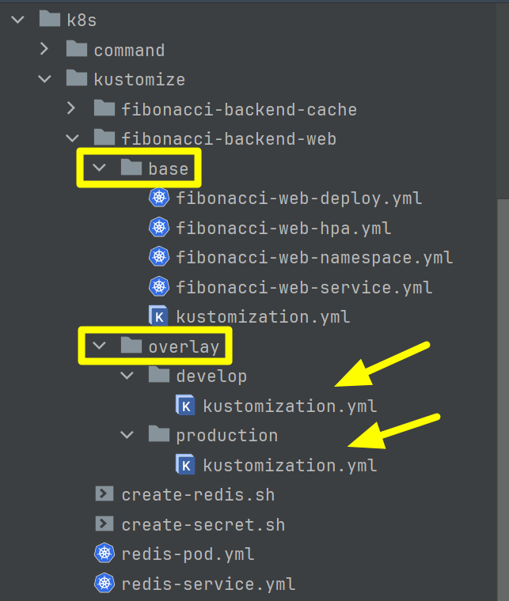

## Kustomize Overlay 작업
- [프로젝트 Github](https://github.com/chagchagchag/fibonacci-backend)
- [kustomize/fibonacci-backend-web](https://github.com/chagchagchag/fibonacci-backend/tree/main/k8s/kustomize/fibonacci-backend-web)
<br/>

## fibonacci-backend-cache 의 kustomize 작업
대략적인 구조는 이렇습니다.<br/>

<br/>

`base` 디렉터리
- 기본적인 리소스 들의 정의 파일들을 둡니다.
- 이렇게 정의된 파일들을 `base` 디렉터리 내에서 kustomize 하는 역할을 하는 파일은 `kustomization.yml` 입니다.
<br/>

`overlay` 디렉터리
- `overlay/develop` 디렉터리
  - `base/kustomization.yml` 파일에서 조합한 리소스파일 들에서 `tag`, `namespace`를 `develop` 에 맞게끔 덮어쓰는 작업을 합니다.
  - `overlay/develop/kustomization.yml` 파일에서 따로 `develop` 버전에 맞도록 재정의한 `namespace`, `tag` 등이 적용되어 재정의됩니다.
- `overlay/production` 디렉터리
  - `base/kustomization.yml` 파일에서 조합한 리소스파일 들에서 `tag`, `namespace`를 `production` 에 맞게끔 덮어쓰는 작업을 합니다.
  - `overlay/production/kustomization.yml` 파일에서 따로 `production` 버전에 맞도록 재정의한 `namespace`, `tag` 등이 적용되어 재정의됩니다.<br/>

이렇게 작성한 파일들은 아래와 같이 적용합니다.
**develop Phase 에 배포할 경우**
```bash filename="bash" {0} copy
$ cd k8s/kustomize/fibonacci-backend-web
$ cd overlay/develop
$ kubectl kustomize ./ | kubectl apply -f -
```
<br/>

이렇게 작성한 파일들은 아래와 같이 적용합니다.
**develop Phase 에 배포할 경우**
```bash filename="bash" {0} copy
$ cd k8s/kustomize/fibonacci-backend-web
$ cd overlay/develop
$ kubectl kustomize ./ | kubectl apply -f -
```
<br/>

**production Phase 에 배포할 경우**
```bash filename="bash" {0} copy
$ cd k8s/kustomize/fibonacci-backend-web
$ cd overlay/develop
$ kubectl kustomize ./ | kubectl apply -f -
```
<br/>

`kubectl kustomize ./` 명령은 현재 디렉터리 내의 `kustomization.yml` 파일에 정의한 리소스들을 기준으로 각각의 리소스를 조합해서 리소스 정의서를 만들어냅니다. 이렇게 해서 명령창에서 `kubectl kustomize ./` 을 실행하면 리소스 정의 yml 이 생성되니다.<br/>

`kubectl apply -f` 앞에 붙은 `-` 의 의미는 표준 입력을 의미합니다. `kubectl kustomize ./` 을 통해서 조합한 리소스 정의에 대한 yaml 문자열이 입출력 파이프라인 명령어인 `|` 을 통해 유입되고 이 파이프라인을 통해 kubectl kustomize ./ 명령어에 인자값으로 전달됩니다.<br/>

## 리소스 파일들
### base 
#### base/kustomization.yml
```yaml filename="base/kustomization.yml" {0} copy
apiVersion: kustomize.config.k8s.io/v1beta1
kind: Kustomization
resources:
- fibonacci-web-namespace.yml
- fibonacci-web-hpa.yml
- fibonacci-web-deploy.yml
- fibonacci-web-service.yml
```
<br/>

#### base/fibonacci-web-deploy,yml
```yaml filename="base/fibonacci-web-deploy.yml" {0} copy
apiVersion: apps/v1
kind: Deployment
metadata:
  name: fibonacci-backend-web-deploy
  namespace: fibonacci
spec:
  replicas: 2
  strategy:
    type: RollingUpdate
    rollingUpdate:
      maxSurge: 1
      maxUnavailable: 0
  selector:
    matchLabels:
      app: fibonacci-backend-web
  template:
    metadata:
      labels:
        app: fibonacci-backend-web
    spec:
      terminationGracePeriodSeconds: 60
      containers:
        - name: fibonacci
          image: chagchagchag/fibonacci-backend-web:0.0.1
          imagePullPolicy: Always
          resources:
            requests:
              memory: "512Mi"
              cpu: "1000m"
            limits:
              memory: "1Gi"
              cpu: "1500m"
          lifecycle:
            preStop:
              exec:
                command: ["/bin/sh","-c","sleep 10"]
          startupProbe:
            httpGet:
              path: /probe/startup
              port: 8080
            initialDelaySeconds: 45
            periodSeconds: 1
            failureThreshold: 10
          readinessProbe:
            httpGet:
              path: /probe/ready
              port: 8080
            initialDelaySeconds: 45
            periodSeconds: 1
            successThreshold: 1
            failureThreshold: 2
          livenessProbe:
            httpGet:
              path: /probe/live
              port: 8080
            initialDelaySeconds: 45
            periodSeconds: 1
            failureThreshold: 10
```
<br/>

#### base/fibonacci-web-service,yml
```yaml filename="base/fibonacci-web-service.yml" {0} copy
apiVersion: v1
kind: Service
metadata:
  name: fibonacci-backend-web-service
  namespace: fibonacci
spec:
  selector:
    app: fibonacci-backend-web
  ports:
    - protocol: TCP
      port: 8080
```
<br/>

#### base/fibonacci-web-hpa.yml
```yaml filename="base/fibonacci-web-hpa.yml" {0} copy 
apiVersion: autoscaling/v2
kind: HorizontalPodAutoscaler
metadata:
  name: fibonacci-backend-hpa
  namespace: fibonacci
spec:
  minReplicas: 2
  maxReplicas: 5
  scaleTargetRef:
    apiVersion: apps/v1
    kind: Deployment
    name: fibonacci-backend-web
  metrics:
    - type: Resource
      resource:
        name: cpu
        target:
          type: Utilization
          averageUtilization: 50
  behavior:
    scaleUp:
      stabilizationWindowSeconds: 30
    scaleDown:
      stabilizationWindowSeconds: 30

```
<br/>

#### base/fibonacci-web-namespace.yml
```yaml filename="base/fibonacci-web-namespace.yml" {0} copy
apiVersion: v1
kind: Namespace
metadata:
  name: fibonacci-web
```
<br/>

### overlay
overlay 에 정의하는 kustomization.yml 에는 주로 배포 Phase 에 맞는 환경, 이미지 명, 태그, 볼륨 명, 각종 환경 변수 등을 덮어쓰는 내용 들을 정의합니다.<br/>
<br/>

#### overlay/develop/kustomization.yml
```yaml filename="overlay/develop/kustomization.yml" {0} copy
apiVersion: kustomize.config.k8s.io/v1beta1
kind: Kustomization
resources:
  - ../../base
images:
  - name: chagchagchag/fibonacci-backend-web
  - newName: chagchagchag/fibonacci-backend-web
  - newTag: 0.0.1-fibonacci-backend-web.01
namespace: fibonacci-web-develop
```
<br/>

#### overlay/production/kustomization.yml
```yaml filename="overlay/production/kustomization.yml" {0} copy
apiVersion: kustomize.config.k8s.io/v1beta1
kind: Kustomization
resources:
  - ../../base
images:
  - name: chagchagchag/fibonacci-backend-web
  - newName: chagchagchag/fibonacci-backend-web
  - newTag: 0.0.1-fibonacci-backend-web.01
namespace: fibonacci-web-production
```
<br/>

