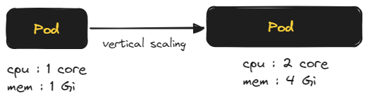
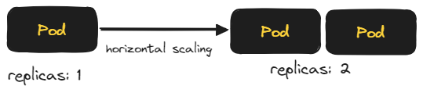
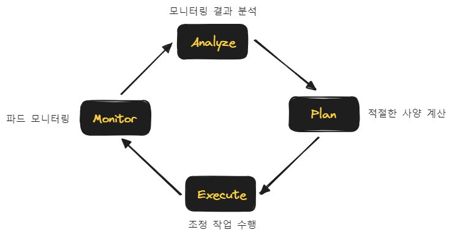
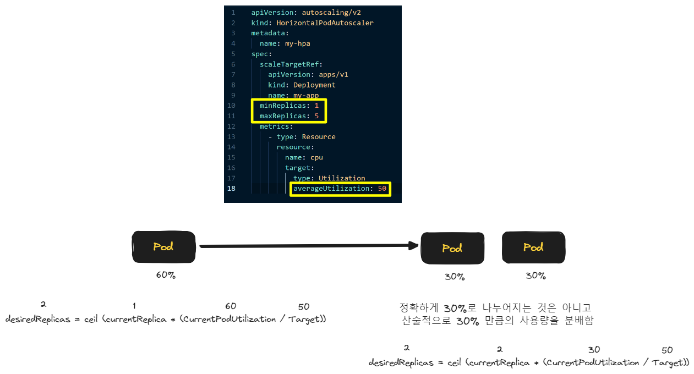
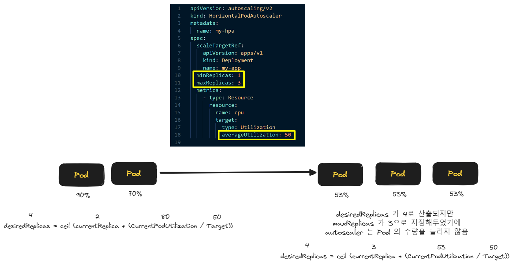
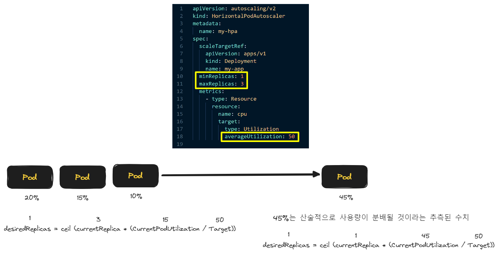

- Doc 문서 정리 직전에 어떻게 정리할지 그냥 요약해봄
<br/>

## 스케일 조정
일반적으로 이야기하는 스케일링은 아래의 두가지 방식들이 있다.
- Vertical Scaling : 수직적 스케일링
- Horizontal Scaling : 수평적 스케일링
<br/>

### 수직적 스케일링 (Vertical Scaling)
인스턴스 하나의 자원의 할당량을 조절하는 것<br/>
작업을 처리하는 인스턴스의 성능을 올리는 것을 `스케일 업` 이라는 표현으로도 부른다.<br/>

<br/>

- 레거시 시스템에서 흔히 보이는 구조
- 대용량 배치, 일괄 대사 작업 등을 수행시 분산 트랜잭션 도입이 힘들 경우에도 이런 구조를 선택하는 경우가 있음
- 수평적 스케일링을 도입하기에 앞서 시간적,인적 요소 고려시 임시적으로 도입하는 경우도 있음
<br/>

### 수평적 스케일링 (Horizontal Scaling)
작업을 처리하는 인스턴스의 수를 늘리거나 줄이는 것<br/>
작업을 처리하는 인스턴스의 수를 늘리는 것을 `스케일 아웃` 이라는 표현으로도 부른다.<br/>

<br/>

- 클라우드 기반의 인프라가 대중화되면서 대중적으로 선호되는 스케일링 방식
- 스케일아웃 기반의 애플리케이션을 구성하기 위해 일반적으로 `Stateless 한 애플리케이션 구성`, `서비스가 네트워크를 분배하는 방식 설계`, `우아한 종료`, `컨테이너의 빠른 시작` 과 같은 요소들을 고려하는 편임
<br/>

수평적 스케일링을 하더라도 파드(Pod) 하나에 대한 스케일 업 역시 스펙을 어느 정도는 고려가 잘 되어야 하고, 초기 구성시 어느 정도의 부하를 견디는지 측정을 해보는 것도 중요함<br/>
<br/>

## Kubernetes 의 오토스케일링
kubernetes 의 오토스케일링은 Pod 단위로 수행된다. 쿠버네티스의 오토스케일러는 파드의 자원 상황을 모니터링하고 모니터링 한 결과에 따라 파드의 사양, 수량을 결정하게 된다. 쿠버네티스의 오토스케일링은 파드 단위로 사양, 수량을 조절하는 작업들이 유연하게 돌아가며, 이런 작업들이 자동으로 수행되도 문제가 발생하지 않도록 시스템 내부적으로 파드의 우아한 종료, 프로브 설정, 서비스에 네트워크가 분배되는 것과 관련된 것들이 유기적으로 잘 돌아가도록 내부적으로 잘 구성되어 있다. <br/>

쿠버네티스 환경에서의 오토스케일링은 적절한 파드의 사양, 수량을 결정해서 배포해두면 그 이후의 작업은 유연하게 넘어갈 수 있고 쿠버네티스 내에서의 파드의 사양, 수량을 결정하는 정책은 굉장히 유연한 편에 속한다.<br/>

일반적인 오토스케일링 시스템에서는 스케일링시에 발생하는 네트워크 순단, 애플리케이션 다운, 스케일링 후에 잘 동작하는지 모니터링을 한다던가 하는 이런 것들이 어려웠었는데 쿠버네티스의 오토스케일링은 이런 것들에 대한 문제들을 고민하지 않아도 된다는 점이 장점이다.<br/>

쿠버네티스는 두 종류의 오토스케일링을 지원한다.
- HPA (Horizontal Pod Autoscaler)
  - 오래전 부터 기본기능으로 지원됐던 기능이다. 현재는 두번째 버전까지 나와있다.<br/>
- VPA (Vertical Pod Autoscaler)
  - 베타버전만 존재하고 특정 클러스터 플랫폼에는 포함되지 않은 기능이다.<br/>
  - Pod 의 자원 사용량에 따라 파드의 CPU, Memory 사용량을 조절
  - 자원사용량을 변경하기에 컨테이너가 재시작하게 되고 HPA와 함께 사용할 경우 충돌가능성이 높다.
<br/>

## 오토스케일링 절차

<br/>

- Monitor
  - 파드의 상태를 모니터링하고 지표를 수집하는 단계
- Analyze
  - 모니터링 단계에서 수집된 지표를 분석
- Plan
  - 파드의 적절한 사양을 계산
- Execute
  - 조정 작업 수행
<br/>

이 과정은 쿠버네티스의 오토스케일러는 계속해서 수행을 한다.<br/>

## 오토스케일러 리소스 정의
오토스케일러 리소스는 아래와 같이 정의한다.
```yaml
apiVersion: autoscaling/v2 ## 1)
kind: HorizontalPodAutoscaler
metadata:
  name: my-hpa
spec:
  scaleTargetRef: ## 2)
    apiVersion: apps/v1
    kind: Deployment
    name: my-app
  minReplicas: 1 ## 3)
  maxReplicas: 5 ## 3) 
  metrics: ## 4) 
    - type: Resource
      resource:
        name: cpu
        target:
          type: Utilization
          averageUtilization: 50 ## 5)
```
<br/>

1\) `apiVersion: autoscaling/v2` : Autoscaler 버전
- Autoscaler 의 버전을 명시한다.
- 꽤 오랫동안 v1 을 사용했고, v2가 나온지는 얼마되지 않았다. 인터넷 자료들 대부분이 v1 을 사용하는 경우가 많다.
- v1 오토스케일러의 경우 대부분 CPU 점유율 기준으로 오토스케일링을 하고, 설정이 간단했었다. 
- v2 오토스케일러의 경우 다양한 자원들에 대해 오토스케일링이 가능하고 설정도 다양해졌다.
- autoscaler 버전은 v1을 사용할지 v2를 사용할지  가능 여부는 쿠버네티스 클러스터 버전에 따라서 달라질 수 있다.
- v2 가 가지고 있는 이점이 많기 때문에 클러스터가 v2를 지원한다면 가급적 v2 를 사용하는 것이 권장되는 편이다.
<br/>

2\) `spec.scaleTargetRef`
- `spec.scaleTargetRef` 는 스케일링이 가능한 리소스 타입이어야 한다.
- 즉, `replicas` 필드를 가지고 있는 리소스 타입에만 적용이 가능하기에 `Statefulset`, `Deployment`, `ReplicaSet` 에만 `spec.scaleTargetRef` 를 적용가능하다.
- 대부분의 경우 `Deployment` 를 지정하는 편이다. 
- 만약 Statefulset 을 지정할 경우 Statefulset 에 연결할 PV를 미리 할당을 해두거나 동적할당을 해야 한다는 점을 고려해서 신중하게 설정해야 한다. 
<br/>

3\) minReplicas, maxReplicas : HPA 의 조정 범위를 지정<br/>
- 레플리카(복제)의 범위를 지정
- 파드를 최소 몇개, 최대 몇개까지로 할지 지정
- minReplicas : 오토스케일러를 사용하지 않을 때 평소에 사용하는 오토스케일러의 수량을 지정
- maxReplicas : 노드에 무리를 주지 않는 선에서 충분한 수치를 지정해주는 것이 좋다.
- 만약 새벽 시간대 처럼 사용량이 적은 시점에 파드 수량을 줄이고 확보한 자원들을 통해 배치작업 등을 수행하려 한다면 minReplicas 를 평소에 줄여두는 것도 하나의 방법이 될수 있는데 주의할 점이 있다. minReplicas를 극도로 줄여두었다가 트래픽 급증 시점에 파드의 기동이 계속해서 발생하는 것으로 인한 처리 지연현상이 발생할 수 있는 이슈가 있다는 점이다. minReplicas 가 너무 작은 것으로 인해 파드의 생성이 자주 이뤄줘야 하는데, 트래픽이 완만하게 올라가는 시점(e.g. 새벽)이 아닌 트래픽이 급증하는 시점(e.g. 출근시간)에는 단점으로 작용할 수 있다. 파드가 구동되는 데에 일정 시간이 걸리기에 파드가 계속해서 구동되기를 기다리는 것으로 인한 지연이 발생할 수 있기 때문이다. 
- 보통 autoscaler 의 스케일 범위는 자원을 절약하기 위한 수준의 범위를 지정하기 보다는 평소에 autoscaler 를 안쓸때 ReplicaSet에 일반적으로 지정하는 수량과 동일한 개념으로 적용하면 되고 갑자기 트래픽이 급증할 때 대응할 수 있는 수량을 최대 수량으로 잡는 것이 좋다.
<br/>

4\) metrics
- Autoscaling 을 할 때 기준이 될 수 있는 자원과 그 기준값을 지정할 때 사용된다.
- v1 에서는 target.averageUtilization 라는 CPU 퍼센트를 간편하게 지정하는 용도로 사용되는 경우가 많았지만 CPU 의 다른 요소들을 설정하는 것이 복잡한 편이었다. 
- v2 에서는 `Resource` 라는 타입을 별개의 타입으로 지정해서 사용할 수 있게 되었고 v2 에서 일반적으로 사용하는 메트릭은 `cpu`, `Memory` 가 보편적이고 이 외에 메트릭이 필요할 때는 커스텀 설정을 통해 추가가 가능하다. 예를 들면 ingress 에서 들어오는 트래픽을 기준으로 파드의 스케일링 설정이 가능하다.
- target 에 지정한 `Utilization` 이라는 타입은 절대적인 수치나 전체적으로 자원을 사용하는 비율이라든지 이런 것들을 지정할 수 있다. 단위는 `%` 단위로 입력한다.
- `averageUtilization` 은 예를 들면 이런 개념이다. "파드 들의 평균적인 CPU 사용량이 `50%` 를 넘지 않으면서 최소 50% 를 소비했으면 한다" 는 요구조건이 있다면 `averageUtilization` 을 50 (%) 로 지정하는 편이다.
<br/>

참고\) Utilization 관련한 자료들은 아래의 자료들이 있다.
- [쿠버네티스 CPU, Memory 관리하기(feat. 사용량 확인, limit, 리소스 모니터링)](https://ltlkodae.tistory.com/41)
- [쿠버네티스 (Kubernetes) 배포를 위한 고급설정](https://ltlkodae.tistory.com/41)

<br/>

5\) averageUtilization
- 평균적인 값이 이 정도가 되어야 함을 정의하며 단위는 % 이다.
- 위의 예제에서는 spec.metrics[0] 가 cpu 타입인데 여기에 대해 averageUtilization 을 50으로 정의했다는 것은 평균적인 CPU 점유율이 50%가 되어야 함을 의미한다.
<br/>

## `averageUtilization` 기반 스케일링 
오토스케일러가 파드(Pod)의 수량을 결정하는 공식은 아래와 같다. (생각보다 단순한 방식의 계산이다)
- `desiredReplicas = ceil(currentReplica * (CurrentPodUtilization/Target))`
<br/>

`(CurrentPodUtilization/Target)`<br/>
`CurrentPodUtilization` 은 전체 파드가 사용하고 있는 자원 사용량의 평균이다.<br/> 
그리고 `CurrentPodUtilization` 을 `Target`(목표 자원사용량) 으로 나눈다.<br/>
<br/>

`currentReplica * (CurrentPodUtilization/Target)`<br/>
위에서 구한 `(CurrentPodUtilization/Target)` 에 현재 레플리카로 기동된 Pod 의 개수를 곱해준다.<br/>
<br/>

`ceil(currentReplica * (CurrentPodUtilization/Target))`<br/>
`currentReplica * (CurrentPodUtilization/Target)` 을 올림처리한다. 이렇게 구해진 수치가 파드의 Autoscaling 에 적용되는 `averateUtilization` 값이 된다.
<br/>

이 과정을 예를 들어서 그림으로 표현해보면 아래와 같다.

<br/>

### 목표 자원사용량을 넘어서도 그대로 유지되는 경우
maxReplicas = 3 이고 averageUtilization = 50 일때 Pod 2기가 각각 90%, 70% 의 CPU를 점유한 상황을 살펴보면 아래와 같다.<br/>

<br/>

### 파드의 수량을 축소하는 경우
maxReplicas = 3 이고 averageUtilization = 50 일때 Pod 2기가 각각 20%, 15%, 10% 의 CPU를 점유한 상황을 살펴보면 아래와 같다.<br/>

<br/>

## HorizontalPodAutoScaler 사용 시 주의점
### 오토스케일링은 즉시 발생하지 않는다는 점에 주의
오토스케일링은 즉각적으로 발생하지 않는다. 파드의 상태에 따라서 파드를 늘렸다가 줄였다가를 즉각적으로 수행하는 것을 반복하는 것으로 인해 자원 사용량이 계속해서 변화한다면 노드 상황도 불안정해질 수 있고 노드 내의 자원도 불안정해지고 시스템도 불안정해질 위험이 존재한다.<br/>

이런 이유로 인해 오토스케일러는 파드의 자원 성능을 기준으로 +/- 5% 수준의 오차범위 내에서는 조정을 하지 않도록 임계치(Margin)을 두어 잦은 스케일링이 일어나지 않게끔 하고 있다. <br/>

한번 오토스케일링이 일어난 후에는 다음 오토스케일링을 수행하기 전 까지 휴식기간을 주어서 잦은 오토스케일링을 방지하기도 하는데 이 휴식기간 수치에 대한 옵션은 수정이 가능하다.<br/>

트래픽이 지속적으로 급속도로 증가하는 상황에서 오토스케일링을 거친 후에 거치는 휴식기간이 길면 오토스케일링이 수행되지 않는 것으로인한 처리 지연이 길어질 수 있는 상황이 생길 수도 있다.<Br/>

이런 이유로 오토스케일링은 1차적인 기본 설정으로 두어야하고 세부적인 설정을 꼭 해주어야 한다.<br/>
<br/>

### 오토스케일링을 고려해서 애플리케이션을 개발해야 함
오토 스케일링은 임의의 시점에 파드가 새로 생성될 수도 있고 임의의 시점에 파드가 종료될 수도 있다. 따라서 파드를 새로 추가해서 스케일 아웃을 통해 트래픽을 나눠서 처리할 수 있는 구조여야 하고 Graceful Shutdown (우아한 종료) 로직을 통해 언제 종료되더라도 종료 시에 해야 하는 필요한 로직처리를 꼭 해줘야 한다.<br/>

### 커스텀 메트릭을 활용해서 기능을 확장하는 방법
v1 버전의 오토스케일러에서는 cpu 기반으로 오토스케일링 기능을 제공했다. 따라서 대부분 오토스케일링을 CPU 기준으로 오토스케일링 리소스를 정의하는 경우가 많다. 일반적으로 스레드 기반의 애플리케이션에서는 스레드 점유율이 높아지면 CPU 점유율이 높아지기도 하기에 CPU 기준으로 오토스케일링을 하는 것이 무리가 있다던가 하는 것은 아니지만 애플리케이션의 작업 성격에 따라서 CPU 바운드 보다는 커넥션의 획득이나 IO 작업으로 인한 대기 문제로 인해 메모리 사용량을 통한 오토스케일링을 지정하는 것이 오히려 더 유의미한 경우가 있다. <Br/>

따라서 CPU 외에도 메모리를 커스텀하게 적절하게 설정하는 것이 필요하다.<br/>

CPU, 메모리 외에도 다른 지표를 사용해야 효율적으로 스케일링을 할 수 있겠다는 생각이 든다면 커스텀 메트릭을 사용하는 것이 추천된다. 커스텀 메트릭 사용시 지표 수집에 대한 세팅을 위해 별도의 커스텀 매트릭 플러그인 설치등을 해주는 것으로 커스텀 메트릭을 사용하는 것이 가능하다.<br/>

